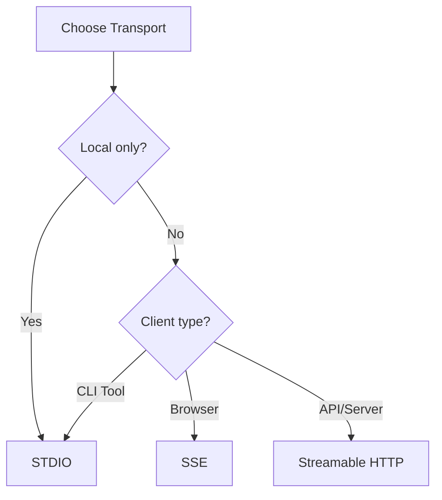

# MCP Transport Options

The Odoo MCP Server supports three transport mechanisms for different use cases:

| Transport | Use Case | Port | Clients |
|-----------|----------|------|---------|
| **STDIO** | Claude Desktop, CLI tools | N/A | Process pipes |
| **SSE** | Web browsers, HTTP clients | 8009 | EventSource, curl |
| **Streamable HTTP** | API integrations, programmatic | 8008 | httpx, fetch API |

## STDIO Transport (Default)

**Best for:** Claude Desktop, command-line tools, local integrations

**Characteristics:**
- Process-to-process communication via stdin/stdout
- No network exposure
- Lowest latency
- Default transport for Claude Desktop

### Setup

```bash
# Install package
pip install -e .

# Run directly
python run_server.py

# Or use installed command
odoo-mcp
```

### Claude Desktop Configuration

```json
{
  "mcpServers": {
    "odoo": {
      "command": "python",
      "args": ["-m", "odoo_mcp"],
      "env": {
        "ODOO_URL": "https://your-instance.odoo.com",
        "ODOO_DB": "your-database",
        "ODOO_USERNAME": "your-username",
        "ODOO_PASSWORD": "your-password"
      }
    }
  }
}
```

## SSE Transport (Server-Sent Events)

**Best for:** Web browsers, real-time dashboards, streaming updates

**Characteristics:**
- One-way server-to-client streaming over HTTP
- Works with EventSource API in browsers
- Simple HTTP GET requests
- No WebSocket required

### Setup

```bash
# Install package
pip install -e .

# Run SSE server
python run_server_sse.py

# With custom configuration
MCP_HOST=localhost MCP_PORT=9000 MCP_SSE_PATH=/events python run_server_sse.py
```

### Environment Variables

| Variable | Default | Description |
|----------|---------|-------------|
| `MCP_HOST` | 0.0.0.0 | Host to bind to |
| `MCP_PORT` | 8009 | Port to listen on |
| `MCP_SSE_PATH` | /sse | SSE endpoint path |

### Docker

```bash
# Build
docker build -t alanogic/mcp-odoo-adv:sse -f Dockerfile.sse .

# Run
docker run -p 8009:8009 \
  -e ODOO_URL=https://your-instance.odoo.com \
  -e ODOO_DB=your-database \
  -e ODOO_USERNAME=your-username \
  -e ODOO_PASSWORD=your-password \
  alanogic/mcp-odoo-adv:sse

# Or with .env file
docker run -p 8009:8009 --env-file .env alanogic/mcp-odoo-adv:sse
```

### Client Examples

**JavaScript (Browser)**
```javascript
const eventSource = new EventSource('http://localhost:8009/sse');

eventSource.onmessage = (event) => {
  const data = JSON.parse(event.data);
  console.log('Received:', data);
};

eventSource.onerror = (error) => {
  console.error('SSE Error:', error);
};
```

**Python**
```python
import requests

with requests.get('http://localhost:8009/sse', stream=True) as response:
    for line in response.iter_lines():
        if line:
            print(line.decode('utf-8'))
```

**curl**
```bash
curl -N http://localhost:8009/sse
```

## Streamable HTTP Transport

**Best for:** API integrations, programmatic access, bidirectional streaming

**Characteristics:**
- Full bidirectional streaming over HTTP
- Works with standard HTTP clients
- POST requests with streaming bodies
- Suitable for server-to-server communication

### Setup

```bash
# Install package
pip install -e .

# Run HTTP server
python run_server_http.py

# With custom configuration
MCP_HOST=localhost MCP_PORT=9000 MCP_HTTP_PATH=/api python run_server_http.py
```

### Environment Variables

| Variable | Default | Description |
|----------|---------|-------------|
| `MCP_HOST` | 0.0.0.0 | Host to bind to |
| `MCP_PORT` | 8008 | Port to listen on |
| `MCP_HTTP_PATH` | /mcp | HTTP endpoint path |

### Docker

```bash
# Build
docker build -t alanogic/mcp-odoo-adv:http -f Dockerfile.http .

# Run
docker run -p 8008:8008 \
  -e ODOO_URL=https://your-instance.odoo.com \
  -e ODOO_DB=your-database \
  -e ODOO_USERNAME=your-username \
  -e ODOO_PASSWORD=your-password \
  alanogic/mcp-odoo-adv:http

# Or with .env file
docker run -p 8008:8008 --env-file .env alanogic/mcp-odoo-adv:http
```

### Client Examples

**Python (httpx)**
```python
import httpx
import json

async with httpx.AsyncClient() as client:
    request_data = {
        "jsonrpc": "2.0",
        "method": "tools/list",
        "params": {},
        "id": 1
    }

    async with client.stream(
        'POST',
        'http://localhost:8008/mcp',
        json=request_data,
        headers={'Content-Type': 'application/json'}
    ) as response:
        async for line in response.aiter_lines():
            if line:
                print(json.loads(line))
```

**JavaScript (fetch)**
```javascript
const response = await fetch('http://localhost:8008/mcp', {
  method: 'POST',
  headers: {'Content-Type': 'application/json'},
  body: JSON.stringify({
    jsonrpc: '2.0',
    method: 'tools/list',
    params: {},
    id: 1
  })
});

const reader = response.body.getReader();
while (true) {
  const {done, value} = await reader.read();
  if (done) break;
  console.log(new TextDecoder().decode(value));
}
```

**curl**
```bash
curl -X POST http://localhost:8008/mcp \
  -H "Content-Type: application/json" \
  -d '{"jsonrpc":"2.0","method":"tools/list","params":{},"id":1}'
```

## Production Deployment

### Nginx Reverse Proxy

For production deployments, use Nginx as a reverse proxy to add SSL, authentication, and rate limiting.

```nginx
# /etc/nginx/sites-available/mcp-odoo

upstream mcp_sse {
    server 127.0.0.1:8009;
}

upstream mcp_http {
    server 127.0.0.1:8008;
}

server {
    listen 443 ssl http2;
    server_name mcp.yourdomain.com;

    ssl_certificate /etc/letsencrypt/live/mcp.yourdomain.com/fullchain.pem;
    ssl_certificate_key /etc/letsencrypt/live/mcp.yourdomain.com/privkey.pem;

    # SSE endpoint
    location /sse {
        proxy_pass http://mcp_sse;
        proxy_http_version 1.1;
        proxy_set_header Upgrade $http_upgrade;
        proxy_set_header Connection '';
        proxy_set_header Host $host;
        proxy_cache_bypass $http_upgrade;

        # SSE-specific settings
        proxy_buffering off;
        proxy_read_timeout 24h;
        chunked_transfer_encoding off;
    }

    # Streamable HTTP endpoint
    location /mcp {
        proxy_pass http://mcp_http;
        proxy_http_version 1.1;
        proxy_set_header Host $host;
        proxy_set_header X-Real-IP $remote_addr;
        proxy_set_header X-Forwarded-For $proxy_add_x_forwarded_for;
        proxy_set_header X-Forwarded-Proto $scheme;

        # Streaming settings
        proxy_buffering off;
        proxy_request_buffering off;
        client_max_body_size 100M;
    }
}
```

### Security Configurations

#### Option 1: API Key Authentication

Secure endpoints with custom API key headers.

```nginx
# /etc/nginx/sites-available/mcp-odoo-secure

# Define API key (store in separate file for production)
map $http_x_api_key $api_key_valid {
    default 0;
    "your-secret-api-key-here" 1;
}

upstream mcp_http {
    server 127.0.0.1:8008;
}

server {
    listen 443 ssl http2;
    server_name mcp.yourdomain.com;

    ssl_certificate /etc/letsencrypt/live/mcp.yourdomain.com/fullchain.pem;
    ssl_certificate_key /etc/letsencrypt/live/mcp.yourdomain.com/privkey.pem;

    # Streamable HTTP endpoint with API key auth
    location /mcp {
        # Validate API key
        if ($api_key_valid = 0) {
            return 401 '{"error": "Unauthorized - Invalid or missing API key"}';
        }

        proxy_pass http://mcp_http;
        proxy_http_version 1.1;
        proxy_set_header Host $host;
        proxy_set_header X-Real-IP $remote_addr;
        proxy_set_header X-Forwarded-For $proxy_add_x_forwarded_for;

        # Streaming settings
        proxy_buffering off;
        proxy_request_buffering off;
        client_max_body_size 100M;
    }
}
```

**Client Usage:**
```bash
# curl with API key
curl -X POST https://mcp.yourdomain.com/mcp \
  -H "X-API-Key: your-secret-api-key-here" \
  -H "Content-Type: application/json" \
  -d '{"jsonrpc":"2.0","method":"tools/list","params":{},"id":1}'
```

```python
# Python with API key
import httpx

headers = {
    "X-API-Key": "your-secret-api-key-here",
    "Content-Type": "application/json"
}

async with httpx.AsyncClient() as client:
    response = await client.post(
        "https://mcp.yourdomain.com/mcp",
        headers=headers,
        json={"jsonrpc": "2.0", "method": "tools/list", "params": {}, "id": 1}
    )
```

#### Option 2: Basic Authentication

Simple username/password authentication.

```nginx
# /etc/nginx/sites-available/mcp-odoo-basic-auth

upstream mcp_http {
    server 127.0.0.1:8008;
}

server {
    listen 443 ssl http2;
    server_name mcp.yourdomain.com;

    ssl_certificate /etc/letsencrypt/live/mcp.yourdomain.com/fullchain.pem;
    ssl_certificate_key /etc/letsencrypt/live/mcp.yourdomain.com/privkey.pem;

    location /mcp {
        # Basic authentication
        auth_basic "MCP Server - Restricted Access";
        auth_basic_user_file /etc/nginx/.htpasswd;

        proxy_pass http://mcp_http;
        proxy_http_version 1.1;
        proxy_set_header Host $host;

        # Streaming settings
        proxy_buffering off;
        proxy_request_buffering off;
    }
}
```

**Setup Basic Auth:**
```bash
# Install apache2-utils for htpasswd
sudo apt-get install apache2-utils

# Create password file (first user)
sudo htpasswd -c /etc/nginx/.htpasswd mcpuser

# Add additional users
sudo htpasswd /etc/nginx/.htpasswd anotheruser

# Set proper permissions
sudo chmod 640 /etc/nginx/.htpasswd
sudo chown root:www-data /etc/nginx/.htpasswd
```

**Client Usage:**
```bash
# curl with basic auth
curl -X POST https://mcp.yourdomain.com/mcp \
  -u mcpuser:password \
  -H "Content-Type: application/json" \
  -d '{"jsonrpc":"2.0","method":"tools/list","params":{},"id":1}'
```

```python
# Python with basic auth
import httpx

async with httpx.AsyncClient() as client:
    response = await client.post(
        "https://mcp.yourdomain.com/mcp",
        auth=("mcpuser", "password"),
        json={"jsonrpc": "2.0", "method": "tools/list", "params": {}, "id": 1}
    )
```

#### Option 3: Mutual TLS (mTLS)

Certificate-based authentication for maximum security.

```nginx
# /etc/nginx/sites-available/mcp-odoo-mtls

upstream mcp_http {
    server 127.0.0.1:8008;
}

server {
    listen 443 ssl http2;
    server_name mcp.yourdomain.com;

    # Server certificate
    ssl_certificate /etc/nginx/certs/server.crt;
    ssl_certificate_key /etc/nginx/certs/server.key;

    # Client certificate validation
    ssl_client_certificate /etc/nginx/certs/ca.crt;
    ssl_verify_client on;
    ssl_verify_depth 2;

    # Optional: Pass client certificate info to backend
    proxy_set_header X-SSL-Client-Cert $ssl_client_cert;
    proxy_set_header X-SSL-Client-DN $ssl_client_s_dn;

    location /mcp {
        proxy_pass http://mcp_http;
        proxy_http_version 1.1;
        proxy_set_header Host $host;

        # Streaming settings
        proxy_buffering off;
        proxy_request_buffering off;
    }
}
```

**Setup mTLS Certificates:**
```bash
# 1. Create CA (Certificate Authority)
openssl genrsa -out ca.key 4096
openssl req -new -x509 -days 365 -key ca.key -out ca.crt

# 2. Create server certificate
openssl genrsa -out server.key 4096
openssl req -new -key server.key -out server.csr
openssl x509 -req -days 365 -in server.csr -CA ca.crt -CAkey ca.key -set_serial 01 -out server.crt

# 3. Create client certificate
openssl genrsa -out client.key 4096
openssl req -new -key client.key -out client.csr
openssl x509 -req -days 365 -in client.csr -CA ca.crt -CAkey ca.key -set_serial 02 -out client.crt

# 4. Create client .p12 bundle (for browser/applications)
openssl pkcs12 -export -out client.p12 -inkey client.key -in client.crt -certfile ca.crt

# 5. Copy certificates to Nginx
sudo cp ca.crt server.crt server.key /etc/nginx/certs/
sudo chmod 600 /etc/nginx/certs/*.key
```

**Client Usage:**
```bash
# curl with client certificate
curl -X POST https://mcp.yourdomain.com/mcp \
  --cert client.crt \
  --key client.key \
  -H "Content-Type: application/json" \
  -d '{"jsonrpc":"2.0","method":"tools/list","params":{},"id":1}'
```

```python
# Python with client certificate
import httpx

async with httpx.AsyncClient(
    cert=("client.crt", "client.key"),
    verify="ca.crt"
) as client:
    response = await client.post(
        "https://mcp.yourdomain.com/mcp",
        json={"jsonrpc": "2.0", "method": "tools/list", "params": {}, "id": 1}
    )
```

#### Option 4: Combined Security (Recommended)

Combine multiple security layers for production.

```nginx
# /etc/nginx/sites-available/mcp-odoo-production

# Rate limiting
limit_req_zone $binary_remote_addr zone=mcp_limit:10m rate=10r/s;

# API key validation
map $http_x_api_key $api_key_valid {
    default 0;
    "prod-api-key-12345" 1;
}

upstream mcp_http {
    server 127.0.0.1:8008;
}

server {
    listen 443 ssl http2;
    server_name mcp.yourdomain.com;

    # SSL configuration
    ssl_certificate /etc/letsencrypt/live/mcp.yourdomain.com/fullchain.pem;
    ssl_certificate_key /etc/letsencrypt/live/mcp.yourdomain.com/privkey.pem;
    ssl_protocols TLSv1.2 TLSv1.3;
    ssl_ciphers HIGH:!aNULL:!MD5;
    ssl_prefer_server_ciphers on;

    # Security headers
    add_header Strict-Transport-Security "max-age=31536000; includeSubDomains" always;
    add_header X-Content-Type-Options "nosniff" always;
    add_header X-Frame-Options "DENY" always;
    add_header X-XSS-Protection "1; mode=block" always;

    # Logging
    access_log /var/log/nginx/mcp_access.log;
    error_log /var/log/nginx/mcp_error.log;

    location /mcp {
        # IP whitelist (adjust for your network)
        allow 10.0.0.0/8;
        allow 172.16.0.0/12;
        allow 192.168.0.0/16;
        deny all;

        # Rate limiting
        limit_req zone=mcp_limit burst=20 nodelay;

        # API key validation
        if ($api_key_valid = 0) {
            return 401 '{"error": "Unauthorized"}';
        }

        # Proxy to MCP server
        proxy_pass http://mcp_http;
        proxy_http_version 1.1;
        proxy_set_header Host $host;
        proxy_set_header X-Real-IP $remote_addr;
        proxy_set_header X-Forwarded-For $proxy_add_x_forwarded_for;
        proxy_set_header X-Forwarded-Proto $scheme;

        # Streaming settings
        proxy_buffering off;
        proxy_request_buffering off;
        proxy_read_timeout 300s;
        proxy_send_timeout 300s;
        client_max_body_size 100M;
    }
}
```

### Systemd Service

Create `/etc/systemd/system/mcp-odoo-sse.service`:

```ini
[Unit]
Description=Odoo MCP Server (SSE Transport)
After=network.target

[Service]
Type=simple
User=mcp
WorkingDirectory=/opt/mcp-odoo-adv
Environment="ODOO_URL=https://your-instance.odoo.com"
Environment="ODOO_DB=your-database"
Environment="ODOO_USERNAME=your-username"
Environment="ODOO_PASSWORD=your-password"
Environment="MCP_HOST=127.0.0.1"
Environment="MCP_PORT=8009"
ExecStart=/opt/mcp-odoo-adv/.venv/bin/python run_server_sse.py
Restart=always
RestartSec=10

[Install]
WantedBy=multi-user.target
```

Enable and start:
```bash
sudo systemctl enable mcp-odoo-sse
sudo systemctl start mcp-odoo-sse
sudo systemctl status mcp-odoo-sse
```

## Security Considerations

### Network Exposure

| Transport | Network Risk | Recommendations |
|-----------|--------------|-----------------|
| **STDIO** | None | No network exposure, safe for local use |
| **SSE** | High | Use reverse proxy with SSL, authentication, rate limiting |
| **HTTP** | High | Use reverse proxy with SSL, authentication, rate limiting |

### Best Practices

1. **Never expose MCP servers directly to the internet**
   - Always use a reverse proxy (Nginx, Caddy, Traefik)
   - Implement SSL/TLS for encrypted transport
   - Add authentication (API keys, OAuth, mTLS)

2. **Implement rate limiting**
   ```nginx
   limit_req_zone $binary_remote_addr zone=mcp:10m rate=10r/s;
   limit_req zone=mcp burst=20 nodelay;
   ```

3. **Restrict access by IP**
   ```nginx
   allow 10.0.0.0/8;
   allow 192.168.0.0/16;
   deny all;
   ```

4. **Use environment variables for secrets**
   - Never hardcode credentials
   - Use `.env` files or secret management systems
   - Rotate credentials regularly

5. **Monitor and log**
   - Enable request logging
   - Monitor for unusual patterns
   - Set up alerts for errors

## Troubleshooting

### SSE Connection Issues

**Problem:** EventSource connection fails

**Solutions:**
```bash
# Check if server is running
curl -v http://localhost:8009/sse

# Verify port is listening
netstat -an | grep 8009

# Check firewall rules
sudo ufw status

# Review logs
tail -f logs/mcp_server_sse_*.log
```

### HTTP Streaming Issues

**Problem:** Stream terminates prematurely

**Solutions:**
```bash
# Disable proxy buffering in Nginx
proxy_buffering off;
proxy_request_buffering off;

# Increase timeouts
proxy_read_timeout 300s;
proxy_send_timeout 300s;

# Check client timeout settings
```

### Port Already in Use

**Problem:** `Address already in use`

**Solutions:**
```bash
# Find process using port 8009 (SSE) or 8008 (HTTP)
lsof -i :8009
lsof -i :8008

# Kill the process
kill -9 <PID>

# Or use a different port
MCP_PORT=8010 python run_server_sse.py
MCP_PORT=8007 python run_server_http.py
```

### CORS Issues (Browser Clients)

**Problem:** CORS errors in browser console

**Solutions:**

Add CORS headers in Nginx:
```nginx
add_header Access-Control-Allow-Origin *;
add_header Access-Control-Allow-Methods 'GET, POST, OPTIONS';
add_header Access-Control-Allow-Headers 'Content-Type';
```

Or configure in FastMCP (if supported in future versions).

## Performance Comparison

| Metric | STDIO | SSE | Streamable HTTP |
|--------|-------|-----|-----------------|
| **Latency** | <1ms | 10-50ms | 10-50ms |
| **Throughput** | Very High | High | High |
| **Overhead** | Minimal | HTTP headers | HTTP headers |
| **Scalability** | 1 client | Many clients | Many clients |
| **Network** | None | Required | Required |

## Choosing the Right Transport



**Use STDIO when:**
- Integrating with Claude Desktop
- Building CLI tools
- No network access needed
- Maximum performance required

**Use SSE when:**
- Building web dashboards
- Real-time browser updates
- Simple client implementation
- One-way data flow sufficient

**Use Streamable HTTP when:**
- Building API integrations
- Server-to-server communication
- Bidirectional streaming needed
- Standard HTTP client compatibility required

## Additional Resources

- [FastMCP Documentation](https://github.com/jlowin/fastmcp)
- [MCP Specification](https://modelcontextprotocol.io)
- [SSE MDN Documentation](https://developer.mozilla.org/en-US/docs/Web/API/Server-sent_events)
- [HTTP Streaming Best Practices](https://web.dev/streams/)
